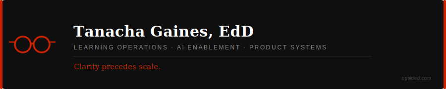

&nbsp;

Strategic operations and AI enablement leader with 15+ years building the systems that make enterprise learning, workforce capability, and product delivery work at scale — not just the programs, but the **infrastructure** behind them.

I work at the intersection of **learning operations**, **workforce architecture**, and **AI-integrated systems** — designing operating models that are visible, governable, and built to compound over time.

&nbsp;

---

## Areas of Focus

<table>
<tr>
<td width="50%">

**Learning Operations & Strategy**
Designing scalable operating models that align product pipelines, learning development, and cross-functional execution.

</td>
<td width="50%">

**Workforce & Capacity Architecture**
Building contractor ecosystems, utilization visibility, and forecasting models that support sustainable, measurable growth.

</td>
</tr>
<tr>
<td width="50%">

**AI Enablement & Governance**
Embedding AI responsibly into learning and operational systems — strengthening capability, quality, and delivery without sacrificing governance.

</td>
<td width="50%">

**Process & Systems Design**
Refining workflows, quality controls, and vendor oversight to reduce friction and protect delivery standards at scale.

</td>
</tr>
</table>

---

## Featured Work

### Human-In-The-Loop Training (HILT)
> **Focus:** AI-enabled curriculum development workflows

A modular training experience that equips learning designers to use AI effectively in content creation — maintaining instructional integrity while improving delivery velocity and consistency across distributed design teams.

`Status: In Development`

---

### Lightway — Advocacy Engagement Platform
> **Focus:** Behavior-based engagement system

A gamified platform guiding users through progressive levels of advocacy (Streetlight → Daylight → Sunshield). Models structured engagement, scalable user progression, and systems-level thinking applied to community behavior change.

`Status: Live, Beta` [https://lightandcover.org/lightway](https://lightandcover.org/lightway)

---

### Stress Quest — Workplace Resilience Learning Game
> **Focus:** Experiential learning design

A card-based and digital learning experience focused on stress management and decision-making. Applies experiential learning principles to real-world behavioral outcomes in the workplace.

`Status: Live, Beta` [https://stress-quest-game.web.app](https://stress-quest-game.web.app/)

---

### AI-Integrated Learning Workflows
> **Focus:** Operational efficiency & AI adoption

Prototypes and workflow systems leveraging AI tools to accelerate curriculum development and learning operations — including responsible usage practices, prompt engineering frameworks, and AI-assisted design methodologies.

---

## Approach

> *When systems are visible, performance compounds.*

My work is systems-first. Strong infrastructure is deliberate, durable, and visible — designed to carry weight as organizations scale.

- Operating models that align product pipeline with execution capacity
- Workforce systems that forecast, allocate, and develop talent at scale
- AI adoption strategies grounded in governance and measurable impact
- Learning infrastructure that reduces delivery friction across distributed teams

---

## Tools & Methods

| Domain | Tools & Practices |
|---|---|
| **AI & Automation** | Claude, ChatGPT, Copilot, Gemini, agentic workflows, AI-first prototyping |
| **Development** | VS Code, GitHub, React (prototyping) |
| **Learning Systems** | LMS platforms, eLearning authoring tools, curriculum design |
| **Operations** | Agile (PMI-ACP), capacity planning, ADKAR change management |
| **Data & Evaluation** | Metrics design, NPS tracking, operational efficiency analysis |

---

## Credentials

- **EdD**, Instructional Technology & Distance Education — Nova Southeastern University
- **MS**, Information Design & Communication — Southern Polytechnic State University
- **Agile Certified Practitioner (PMI-ACP)** — Project Management Institute
- **Prosci Certified Change Practitioner**
- **Certificate, Change Management** — ATD

---

## Connect

| | |
|---|---|
| **Consulting & Advisory** | [opsided.com](https://opsided.com) |
| **LinkedIn** | [linkedin.com/in/tanacha](https://www.linkedin.com/in/tanacha) |
| **GitHub** | [github.com/tnacha](https://github.com/tnacha) |

&nbsp;

<i>Scale requires structure. Let's build it right.</i>

