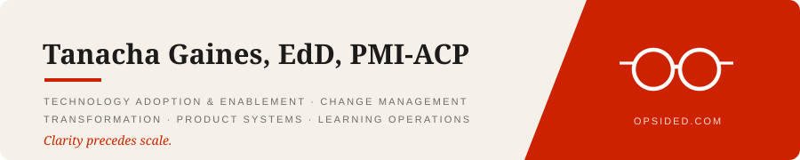
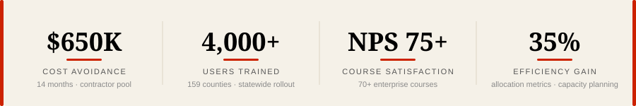
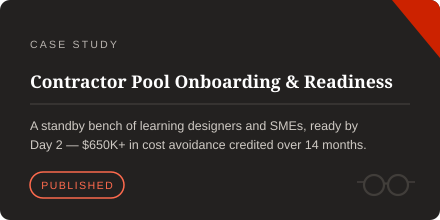
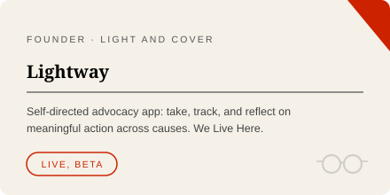
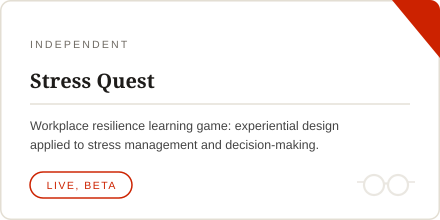
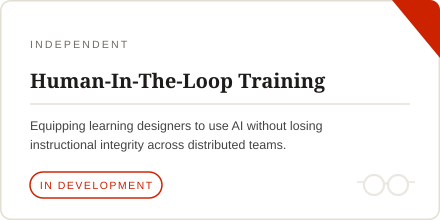
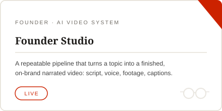

&nbsp;

**Learning Operations · AI Enablement · Product Systems**

I build the infrastructure that makes enterprise learning, workforce capability, and product delivery work at scale, not just the programs, but the operating models, governance, and systems behind them. I've been the hands-on systems administrator, and I've built the governance around administrators: my work deliberately spans both altitudes.

Through **[Opsided LLC](https://opsided.com)**, I consult with organizations on operating-model design, learning systems, and AI-enabled process improvement.

&nbsp;

---

## Three Pillars

<table>
<tr>
<td width="33%">

**Learning Operations**
Operating models that align product pipelines, learning development, workforce capacity, and cross-functional execution, with the forecasting and utilization visibility to sustain them.

</td>
<td width="33%">

**AI Enablement**
Embedding AI responsibly into learning and operational systems: agentic workflows, adoption strategy, and training that strengthen capability without sacrificing governance.

</td>
<td width="33%">

**Product Systems**
Designing and shipping the systems themselves: intake workflows, quality controls, delivery infrastructure, and standalone learning products.

</td>
</tr>
</table>

---

## Selected Outcomes

*From my individual leadership roles inside enterprise learning organizations, separate from Opsided consulting engagements.*

- **How the $650K was built**: contingent workforce architecture for a talent pool spanning ~360 contracts: readiness standards, skills-to-role matching, and deployment visibility, built on async onboarding that replaced individually delivered orientation and a bench that delivered well below the standard contract rate without a quality or ramp penalty. [Read the case study →](contractor-pool-readiness-program.md)
- **AI adoption campaigns** for an internal AI platform used by learning, sales, and solutions teams: awareness → engagement → action, measured and iterated.

---

## Projects & Case Study

<table>
<tr>
<td width="50%"></td>
<td width="50%"></td>
</tr>
<tr>
<td width="50%"></td>
<td width="50%"></td>
</tr>
<tr>
<td width="50%"></td>
<td width="50%"></td>
</tr>
</table>

<strong>Lightway & Light and Cover</strong>: founder

 

Lightway is the flagship app of **Light and Cover**, a community-focused advocacy initiative I founded to empower individuals to be champions of a cause in whatever way they can: self-directed, flexible, and free from pressure or performance metrics. The vision: a world where everyday advocacy is visible, valued, and sustained, from individual awareness to broader systems change. *We Live Here.*

The Lightway app helps people take, track, and reflect on meaningful action across the causes they care about through a flexible progression model, Awareness (Streetlight) → Action (Daylight) → System-level Impact (Sunshield), and was designed and built leveraging AI-enabled development practices. As founder, I lead strategy, brand identity and positioning, product vision, advisory board development, and community partnerships.

<strong>Stress Quest</strong>: experiential learning design

 

A card-based and digital learning experience focused on stress management and decision-making. Applies experiential learning principles to real-world behavioral outcomes in the workplace.

<strong>Founder Studio</strong>: AI-assisted advocacy video system

 

Founder Studio is a video production system I designed and configured to solve a founder problem: getting a consistent, trustworthy message out repeatedly without re-recording every time. A topic goes in, and the system generates the script and scene plan, produces narration in my own voice, selects and sequences footage from a tagged library, and composes a finished 1080p video with exported captions.

Tone, color, typography, pacing, calls to action, and even preferred and avoided language are defined in a brand profile, so output stays on message by design rather than by review. The first video is published on the [Light & Cover Advocacy channel](https://www.youtube.com/@LightCoverAdvocacy). The same system is what I use to explain and inform on issues that need more than a paragraph.

<strong>Human-In-The-Loop Training (HILT)</strong>: AI-enabled curriculum workflows

 

A modular training experience that equips learning designers to use AI effectively in content creation, maintaining instructional integrity while improving delivery velocity and consistency across distributed design teams.

---

## Consulting Engagements: Opsided LLC

*Selected recent engagements. Client names withheld by agreement.*

<strong>Operating Model Redesign: Boutique Law Firm</strong> · process-first operating model diagnosis

 

Diagnosed how work actually flowed through a small legal practice and delivered a full operating-model recommendation: single-front-door intake with a clear approval gate, a defined case pipeline and lifecycle, SOP priorities, a referral protocol with fee tracking, and success metrics staged across 30-day to 12-month horizons. Anchored in a simple discipline: **process first (what people do and decide), systems second (where the work lives)**, because buying software before the process is settled just automates today's confusion.

<strong>Training & Systems Integration: Enterprise CRM/Field-Service Implementation</strong> · bridging systems and learner-ready training

 

Embedded mid-implementation (HubSpot + Zuper) to translate a still-stabilizing systems build into a structured training program for **14 role personas**. Redesigned the strategy for planned "on-the-job" training moments, and recommended EdTech for eLearning execution.

<strong>Curriculum Storyboarding & QA: National Tech-Education Nonprofit</strong> · learning experience design and QA

 

Storyboarded and QA'd curriculum in Articulate Rise: defined content flow for learning outcomes, added instructional context and interactive components, developed knowledge checks, and iterated with SMEs and stakeholders under fixed sprint deadlines.

<strong>Commemorative Publication Design: County Women's Commission</strong> · visual communication design

 

Designed the cover for a 50th-anniversary commemorative book honoring five decades of a county women's commission, commissioned through a university center for the advancement of women.

---

## Speaking & Community

**Director of Workshops & Webinars: ATD Los Angeles**
I organize and host professional-growth and networking events for ATD members and the wider L&D community, sourcing speakers and vendor partners, promoting events, and facilitating sessions end to end.

Recent highlight: **["Agentic AI in Action"](https://www.atdla.org/event-6721818)**, a two-hour hands-on workshop. I produced the event, opened with a framing talk on agentic AI for practitioners, then introduced the guest speakers who led live training and demos.

**Speaker: "Just Because We Can...", PMI Los Angeles Chapter (September 19, 2026)**
An Ignite Talk, *Rethinking expertise, technology, and the future of project execution*, bringing my operations and workforce-transformation perspective to "The Moment Everything Changed: The Shift from Expert to Explorer," an in-person engineering industry networking evening in Long Beach exploring what happens when AI meets the systems that run the world. [Event details →](https://pmi-la.org/calendar?eventId=719) · [LinkedIn event →](https://www.linkedin.com/events/7497736112036163585/)

**Speaker: "Essential Design Tips for Non-designers", TLDC Visual Design for Learning 2024**
A jam-packed session for the Training, Learning, and Development Community that takes non-designers beyond the context of their learning content and toward the design and display of it: core visual principles (whitespace, contrast, proximity, alignment, limiting colors and typefaces), color and accessibility (Section 508, contrast, color blindness), free photo resources to punch up materials, and layers-first tool tips for Adobe Photoshop, Illustrator, InDesign, and PowerPoint. [Watch the recording →](https://www.thetldc.com/events/2024/recordings-visual-design-for-learning-2024)

**Contributor: Workshop Design Guide, L&D Shakers**
A community-built guide that walks newer designers through the eight elements of workshop design that deserve the most critical thinking: stakeholders, purpose, participants, outcomes, metrics, experience, activities, and notes to the facilitator. I'm one of the named practitioner contributors. [View the guide →](https://app.notion.com/p/Workshop-Design-Guide-19dbb17f9f7d8053b5cddf3fd6c62202)

---

## Approach

> *When systems are visible, performance compounds.*

- **Process first, systems second.** Define what people do and decide before choosing where the work lives.
- **Pilot, then scale.** Prove the model with one team or business unit before rolling it wide.
- **The thinking is shared freely; the building is the engagement.** Diagnosis and direction up front, in good faith, with implementation as a defined, phased scope.
- **AI with governance.** Adoption strategies grounded in quality standards and measurable impact, not novelty.

---

## Tools & Methods

| Domain | Tools & Practices |
|---|---|
| **AI & Automation** | Claude, ChatGPT, Copilot, Gemini, agentic workflows, AI-first prototyping |
| **Learning Systems** | Canvas, D2L Brightspace, Moodle, Docebo, Blackboard; Articulate Rise; SCORM; curriculum design (ADDIE, Kirkpatrick) |
| **Operations & Workflow** | Asana, Jira, Salesforce, HubSpot, Zuper; intake-to-allocation workflow design; capacity planning |
| **Change Management** | Prosci/ADKAR change practice, adoption campaigns, champions networks |
| **Data & Evaluation** | Tableau, Power BI, metrics design, NPS tracking, utilization and spend analysis |
| **Development** | VS Code, GitHub, React (prototyping), Agile (PMI-ACP) |

---

## Credentials

- **EdD**, Instructional Technology & Distance Education, Nova Southeastern University
- **MS**, Information Design & Communication, Southern Polytechnic State University
- **Agile Certified Practitioner (PMI-ACP)**, Project Management Institute
- **Prosci Certified Change Practitioner**
- **Certificate, Change Management**, ATD

---

## Connect

| | |
|---|---|
| **Consulting & Advisory** | [opsided.com](https://opsided.com) |
| **LinkedIn** | [linkedin.com/in/tanacha](https://www.linkedin.com/in/tanacha) |
| **GitHub** | [github.com/tnacha](https://github.com/tnacha) |

&nbsp;

<i>Scale requires structure. Let's build it right.</i>

